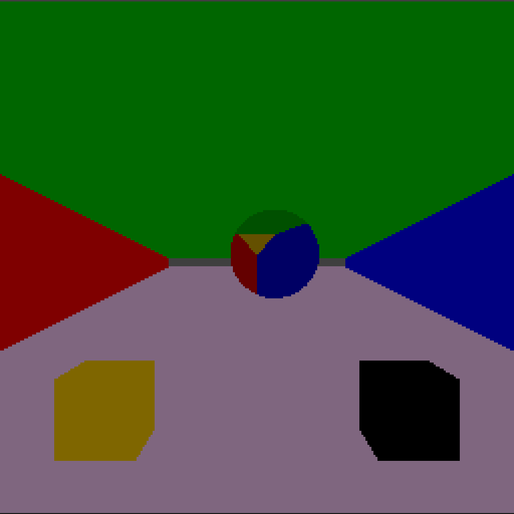

# RAYTRACER_3

## Instrucciones 

Para obtener la nota completa de ésta tarea deben entregar lo siguiente:

--> Código fuente capaz de renderizar planos, discos y cubos por medio de un Ray Intersect Algorithm.
 
 
--> El programa principal debe mostrar un cuarto hecho con planos similar a la imagen (mínimo de cinco planos, material de su elección).
 
 
--> Dentro del cuarto colocar dos cubos en cualquier posición y un disco en cualquier posición y orientación.
 
 
--> Usen los materiales que quieran.

## Output obtenido
Mediante la implementación del código visto en clase se pudo obtener la construccion del siguiente modelo:
 
 
